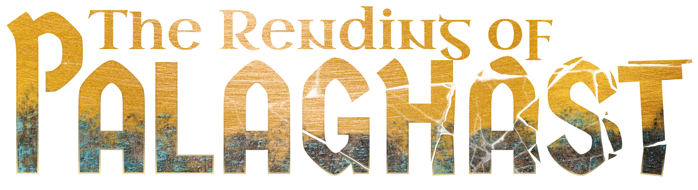
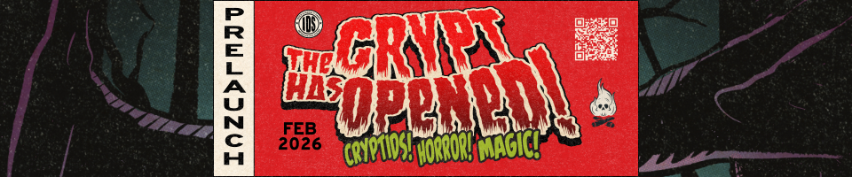
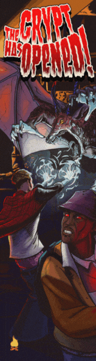

  

# Welcome to the online document for **The Rending of Palaghast** 
This is a living document and repository for the development for the Daggerheart Campaign Frame.

[The Pitch](pages/campaign_frame/the_pitch.html){: .btn} [Overview](pages/campaign_frame/overview.html){: .btn} [Communities](pages/campaign_frame/communities.html){: .btn}
[Ancestries](pages/campaign_frame/ancestries.html){: .btn} [Class](pages/campaign_frame/class.html){: .btn} [Player Principles](pages/campaign_frame/player_principles.html){: .btn}
[GM Principles](pages/campaign_frame/gm_principles.html){: .btn} [Distinctions](pages/campaign_frame/distinctions.html){: .btn} [Inciting Incident](pages/campaign_frame/inciting_incident.html){: .btn}
[Campaign Mechanics](pages/campaign_frame/campaign_mechanics.html){: .btn} [Session 0 Questions](pages/campaign_frame/session_zero_questions.html){: .btn} [Downloads](files/Abyssal Cards.zip){: .btn} 

---

<a href="https://www.thecrypthasopened.com">The Crypt Has Opened</a> crowdfunding campaign launches this coming February, 2026. Become a magical practitioner and fight cryptids, ghosts, and cultists in a twisted 90s hellscape.

---

## Welcome To The Rending

  

What if there was only one deity? What if they diety died? This is the starting point for The Rending of Palaghast. You live in a broken world, literally, that is besiged by daemons that swirl within the Abyssal Sea. Nine Exemplars -- living relics of the deceased god -- rule thier realms, grants divine powers to their worshippers, and protect the crumbling world.

New Gods, beings who have gained their own divine powers beyond that of the Exemplars now threaten normalcy. While the practice of forbidden Abyssal Magic spreads throughout the Reliquaries. 

This is a setting of exploration, divine right, science-fiction fantasy, and uncovering deep truths. Use the navigation above or to the left to learn more.

I hope you enjoy reading *The Rending of Palaghast* and please if you have any ideas or discover some issues with the setting send an email to [info@whensuddenly.games](mailto:info@whensuddenly.games).

---

  

